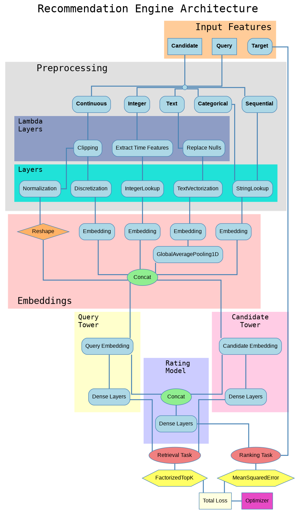

# Recommendation Engine

Deep learning-based recommendation system using TensorFlow Recommenders (TFRS). Preprocessing steps already included within the model with the most popular transformations. It leverages multi-tasking with *Retrieval* and *Ranking* tasks, built on top of Query and Candidates towers. Each of them employs a multi-layered deep neural network on top of embedding to model complex patterns and improve recommendation quality.

## Features

- **Preprocessing**: Includes common preprocessing steps previously defined by a configuration file, everything is encapsulated within the model.
- **Sequential Features**: Supports sequential features, allowing the model to learn from user behavior over time.
- **Cross Features**: Supports cross features, enabling the model to learn interactions between different features.
- **Retrieval**: Efficiently retrieves relevant items from a large dataset.
- **Ranking**: Ranks the retrieved items based on target score defined by the user through a multi-layered deep neural network.
- **Multi-tasking**: Combines retrieval and ranking tasks to improve overall recommendation quality.
- **Multi-layered Deep Neural Network**: Utilizes a multi-layered deep neural network to model complex patterns in the data.
- **Experiments**: A set of experiments are included as helper functions to evaluate different deep layers architectures and resampling strategies to balance target feature (Random Under Sampling, Random Over Sampling, Gaussian Noise).
- **Optuna Optimzation**: Uses Optuna for hyperparameter optimization, allowing the model to find the best configuration for the given dataset.

For a detailed usage example, refer to the project [E-Commerce Recommendation System](https://github.com/sagravela/recommendation-system).
